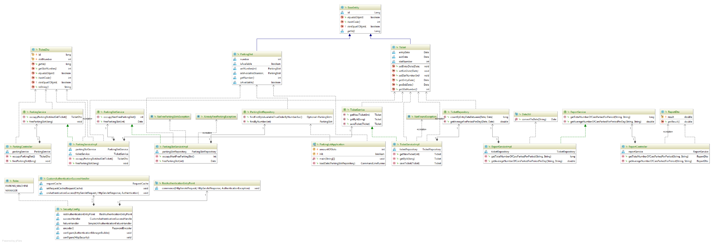
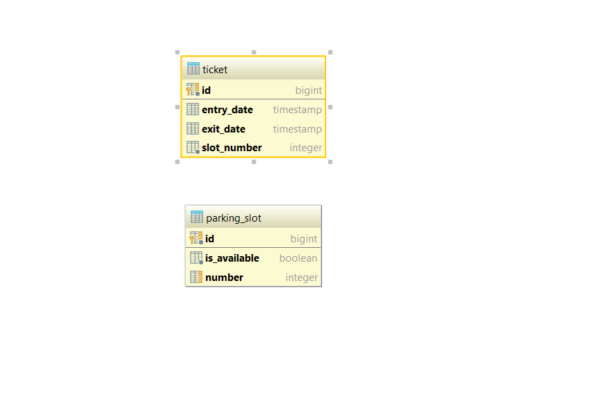

## Parking lot app

Initial requirements see by link [description](Part%20A%20-%20Java%20and%20DB%20design%20and%20code%20assignment.docx).

### Rest API:
You can see and try API in Swagger UI.
Swagger UI is available by address: /swagger-ui.html

### Class diagram:

### DB design:
